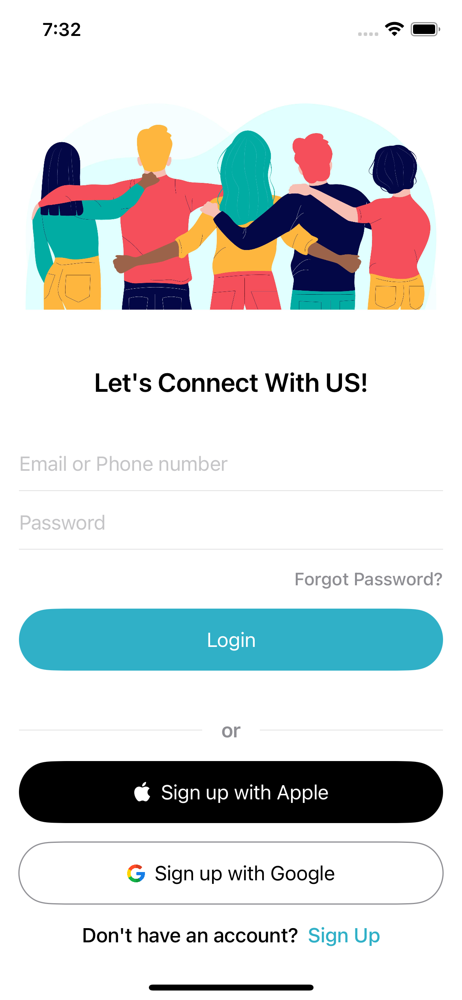
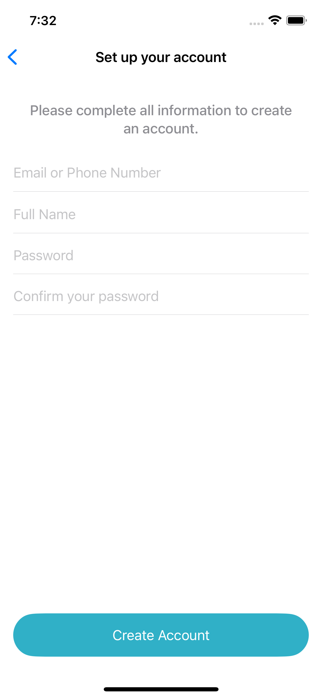

# Firebase Auth SwiftUI Series - Login, Signup, and More

Welcome to the **Firebase Auth SwiftUI Series** repository! This project demonstrates how to build a comprehensive mobile app using Firebase Authentication in SwiftUI, covering various functionalities including Login, Signup, Profile management, Social login, and Password reset.

## Series Overview
This repository is part of a series where we will cover the following topics:

1. **[Part 1: Login and Signup UI](https://youtu.be/USivbJZ-FVM?si=bTcZVPryYXxhTVdT)**
2. **[Part 2: User Authentication and Session Management (In Progress ...)]()**
3. **[Part 3: Profile Management (In Progress ...)]**
4. **[Part 4: Social Login Integration (Google, Facebook) (In Progress ...)]**
5. **[Part 5: Forgot Password Functionality (In Progress ...)]**

## Features
- User-friendly Login and Signup screens
- Integration with Firebase Authentication
- MVVM design pattern
- Responsive UI for various device sizes
- Detailed explanations and implementation of various functionalities

## Screenshots
Below are the images of the Login and Signup screens:

### Login Screen

### Signup Screen

