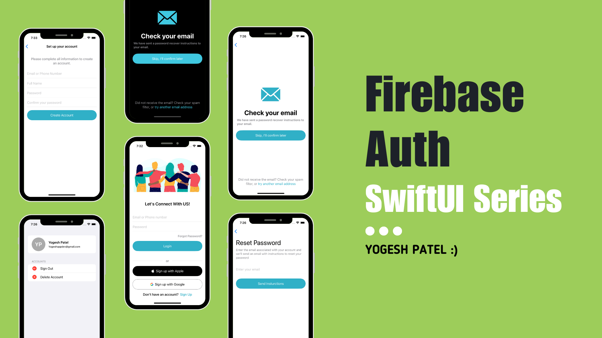

# Firebase Auth SwiftUI Series - Login, Signup, and More

Welcome to the **Firebase Auth SwiftUI Series** repository! This project demonstrates how to build a comprehensive mobile app using Firebase Authentication in SwiftUI, covering various functionalities including Login, Signup, Profile management, Social login, and Password reset.

## Series Overview
This repository is part of a series where we will cover the following topics:

1. **[Part 1: Login and Signup UI](https://youtu.be/USivbJZ-FVM?si=bTcZVPryYXxhTVdT)**
2. **[Part 2: User Authentication and Session Management](https://youtu.be/BRbGVPSjP7I)**
3. **[Part 3: Profile Management](https://youtu.be/4w9NKhkSjPk)**
4. Part 4: Forgot Password Functionality (In Progress ...)
5. Part 5: Routing & Navigation in SwiftUI (In Progress ...)
